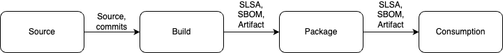

# Secure SDLC Control Plane API

---

# Software Supply Chain Security

- Supply chain security is about securing the production and consumption of software.
- When you consume software you want to ensure you are keeping yourself and your customers safe
- When you produce software you are part of someone else’s supply chain

---

# Securing the Software Supply Chain is Securing the SDLC

- SDLC is how code becomes software, systems and services

---

# SDLC is not a Monolithic Process

- Different components owned by different parties
- Different departments
- SaaS
- Other people’s software

---

# Thinking About the SDLC

Linked processes with a set of inputs and outputs



---

# Why Not an API?

- This lends itself to thinking of it as a set of API contracts
- We can define this as a set of OpenAPI specifications representing the various systems and services in the SDLC.

---

# Example

```yaml
paths:
  /build:
    post:
      tags:
        - build
      summary: Add a new build to run
      description: Add a new build
      operationId: addBuild
      requestBody:
        description: Create a new build
        content:
          application/json:
            schema:
              $ref: '#/components/schemas/Build'
          application/xml:
            schema:
              $ref: '#/components/schemas/Build'
          application/x-www-form-urlencoded:
            schema:
              $ref: '#/components/schemas/Build'
        required: true
```

---

# Example (cont.)

```yaml
Build:
      type: object
      properties:
        id:
          type: integer
          format: uint16
          example: 123
        gitRef:
          $ref: '#/components/schemas/GitRef'
        buildCommand:
          type: array
          items:
            type: string
            example: ["go", "build"]
        buildType:
          type: string
          enum:
            - go
      xml:
        name: build
```

---

# Example (cont.)

```json
"definitions": {
      "BuildDefinition": {
        "description": "A structure representing the build definition of the SLSA Provenance v1 Predicate.",
        "type": "object",
        "required": [
          "buildType",
          "externalParameters"
        ],
        "properties": {
          "buildType": {
            "type": "string",
            "format": "uri"
          },
          "externalParameters": {
            "description": "..."
            "type": "object",
            "additionalProperties": true
          },
```